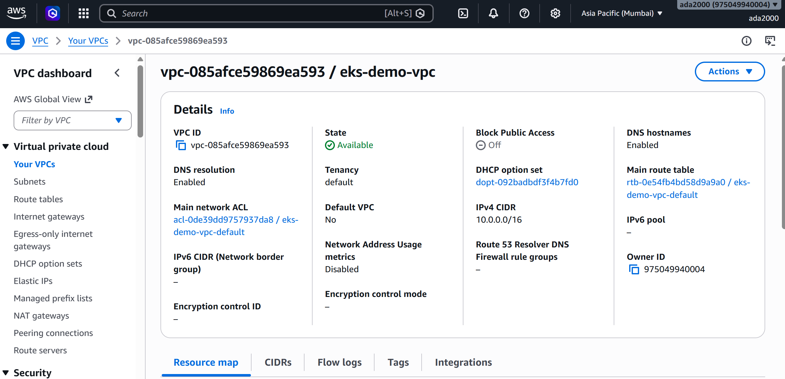

# DevOps Take-Home Assignment

## Overview

This repository contains my solution for the DevOps Take-Home Assignment. The objective was to provision a production-like Kubernetes environment using Infrastructure as Code, deploy a sample microservice, and configure monitoring for both the Kubernetes cluster and the deployed application.

The solution uses **Terraform** to provision the infrastructure on **Amazon EKS**, **Helm** to package and deploy the application, and **Prometheus + Grafana** for monitoring.

---

# Technology Stack

- AWS EKS
- Terraform
- Docker
- Amazon ECR
- Kubernetes
- Helm
- Prometheus
- Grafana
- AWS EBS CSI Driver
- Metrics Server

---

# Project Structure

```text
.
├── terraform/
│   ├── providers.tf
│   ├── variables.tf
│   ├── vpc.tf
│   ├── eks.tf
│   ├── addon.tf
│   ├── ecr.tf
│   ├── outputs.tf
│   └── terraform.tfvars
│
├── hello-world/
│   ├── app.py
│   ├── Dockerfile
│   ├── requirements.txt
│   └── helm/
│       ├── Chart.yaml
│       ├── values.yaml
│       └── templates/
│
└── README.md
```

---

# Architecture

```
                   Terraform
                       │
                       ▼
                 AWS Infrastructure
                       │
          ┌────────────┴────────────┐
          │                         │
         VPC                   Amazon EKS
                                    │
                     ┌──────────────┴──────────────┐
                     │                             │
              Hello World App             Monitoring Stack
                     │                     Prometheus
                     │                     Grafana
                     │
                     ▼
               Kubernetes Service
```

---

# Features

- Provisioned AWS infrastructure using Terraform
- Created Amazon EKS cluster with managed node group
- Created Amazon ECR repository
- Configured AWS EBS CSI Driver with IRSA
- Deployed Hello World microservice using Helm
- Installed Prometheus monitoring stack
- Installed Grafana
- Installed Metrics Server
- Configured Grafana dashboards for Kubernetes monitoring

---

# Deployment

## Clone Repository

```bash
git clone https://github.com/iamaayushdeep/lucidity.git

cd lucidity
```

---

## Provision Infrastructure

```bash
cd terraform

terraform init

terraform plan

terraform apply
```

Terraform provisions:

- VPC
- Private Subnets
- Route Tables
- Internet Gateway
- NAT Gateway
- Amazon EKS Cluster
- Managed Node Group
- Amazon ECR Repository
- EKS Addons
- IAM Roles
- AWS EBS CSI Driver

---

## Configure kubectl

```bash
aws eks update-kubeconfig \
--region ap-south-1 \
--name eks-demo
```

Verify

```bash
kubectl get nodes
```

---

## Build Docker Image

```bash
docker build -t hello-world .
```

Push image to Amazon ECR.

---

## Deploy Application

```bash
cd hello-world/helm

helm install hello-world .
```

Verify

```bash
kubectl get pods
kubectl get svc
```

---

## Install Monitoring

Prometheus

```bash
helm install prometheus prometheus-community/prometheus \
-n monitoring \
--create-namespace
```

Grafana

```bash
helm install grafana grafana/grafana \
-n monitoring
```

Metrics Server

```bash
helm install metrics-server metrics-server/metrics-server \
-n kube-system
```

---

# Validation

## Verify Nodes

```bash
kubectl get nodes
```

## Verify System Components

```bash
kubectl get pods -n kube-system
```

## Verify Monitoring Stack

```bash
kubectl get pods -n monitoring
```

---

# Infrastructure Provisioned using Terraform

## Amazon VPC



Terraform provisions the VPC, networking components, private subnets, route tables and supporting infrastructure required for the EKS cluster.

---

## Amazon EKS Cluster


Amazon EKS cluster provisioned successfully with managed node groups.

---

# Kubernetes Cluster

## Worker Nodes


All worker nodes are in the **Ready** state.

---

## Kubernetes System Components


Core Kubernetes components including:

- CoreDNS
- kube-proxy
- AWS VPC CNI
- AWS EBS CSI Driver
- Metrics Server

are running successfully.

---

# Monitoring Stack

## Monitoring Namespace


Prometheus, Grafana, Node Exporter and kube-state-metrics are deployed successfully.

---

# Grafana Dashboards

## Node Exporter Dashboard


Displays:

- CPU Usage
- Memory Usage
- Filesystem Usage
- Disk I/O
- Network Usage
- Load Average

---

## Kubernetes Cluster Dashboard


Displays:

- Cluster CPU
- Cluster Memory
- Pod Status
- Node Status
- Storage
- Network

---

## Kubernetes Cluster Monitoring Dashboard


Provides an overall operational view of Kubernetes resources and cluster health.

---

# Cleanup

To remove all resources:

```bash
cd terraform

terraform destroy
```

---


# Repository

GitHub Repository:

**https://github.com/iamaayushdeep/lucidity**
